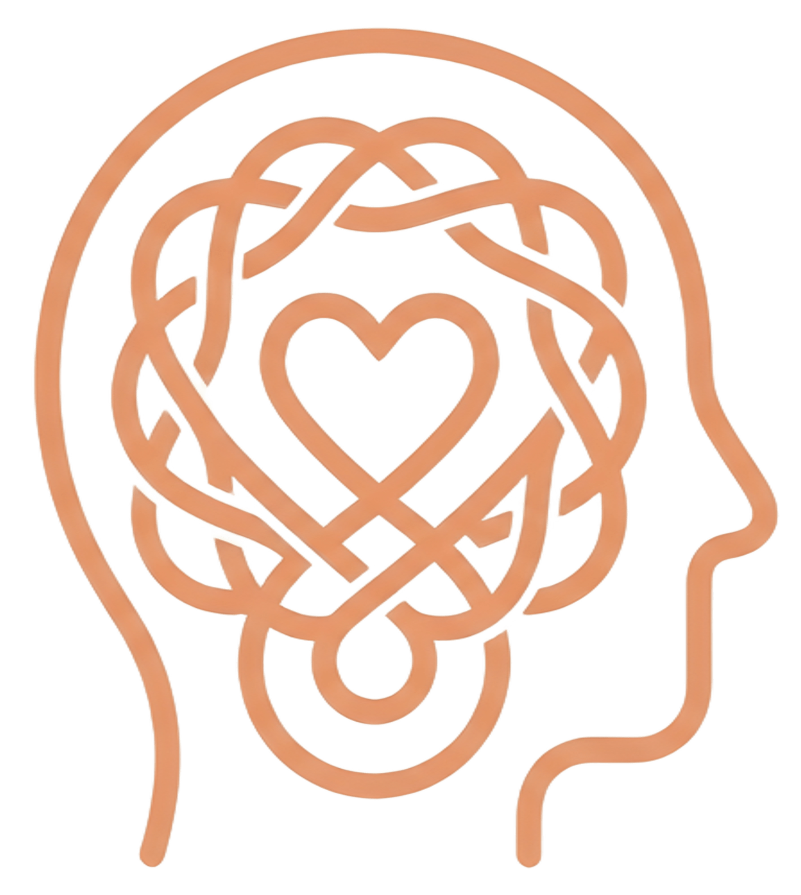
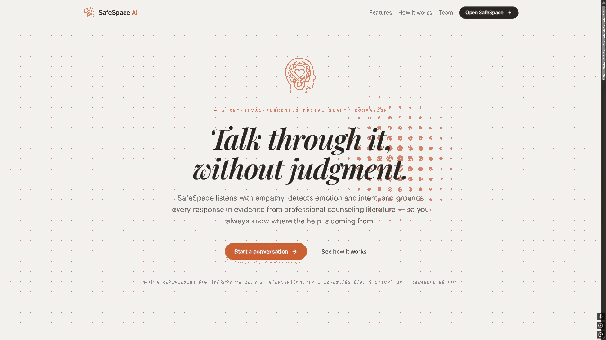

<div align="center">



# SafeSpace AI — Frontend

**Conversational UI for the SafeSpace AI mental health chatbot**


[Try it here!](https://duospace-safespace-ai-frontend.hf.space/about) 
</div>

---

> [!WARNING]
> **SafeSpace AI is not a substitute for professional mental health care.** Always direct users in genuine distress to qualified professionals or crisis resources.

---

## 📦 Repositories

| Component | Repository |
|-----------|------------|
| 💻 React Frontend *(this repo)* | https://github.com/ZeyadMahmoudAmrMohamed/SafeSpaceAI |
| 🤖 AI + FastAPI Backend | https://github.com/3omdawy11/SafeSpaceAI |

The backend repo contains the full NLP pipeline, RAG engine, and REST API. This repo is the chat interface that connects to it.

---

## 🎯 Overview

A real-time conversational UI built with React 19 and TanStack Router. It connects to the SafeSpace AI FastAPI backend and supports both text and voice input via OpenAI Whisper speech-to-text.

<div align="center"></div>

---

## 🛠 Tech Stack

| Layer | Technology |
|-------|-----------|
| Framework |  +  |
| Routing | TanStack Router + TanStack Start |
| Data fetching | TanStack Query |
| Styling |  + shadcn/ui (Radix) |
| Speech to text | OpenAI Whisper via Groq |
| Build |  |

---

## ⚙️ Quick Start

```bash
git clone https://github.com/ZeyadMahmoudAmrMohamed/SafeSpaceAI
cd SafeSpaceAI && cp .env.example .env   # point VITE_API_URL at the backend
npm install
npm run dev
```

The backend must be running on `localhost:8000` (or update `VITE_API_URL` in `.env`). See the [backend repo](https://github.com/3omdawy11/SafeSpaceAI) for setup instructions.

---

## 👥 Team

| Mohamed Emad | Ziad Mahmoud |
|:---:|:---:|
| [](https://github.com/3omdawy11) | [](https://github.com/ZeyadMahmoudAmrMohamed) |

<div align="center">
<br/>
<sub>Built as an NLP course capstone · SafeSpace AI</sub>
</div>
